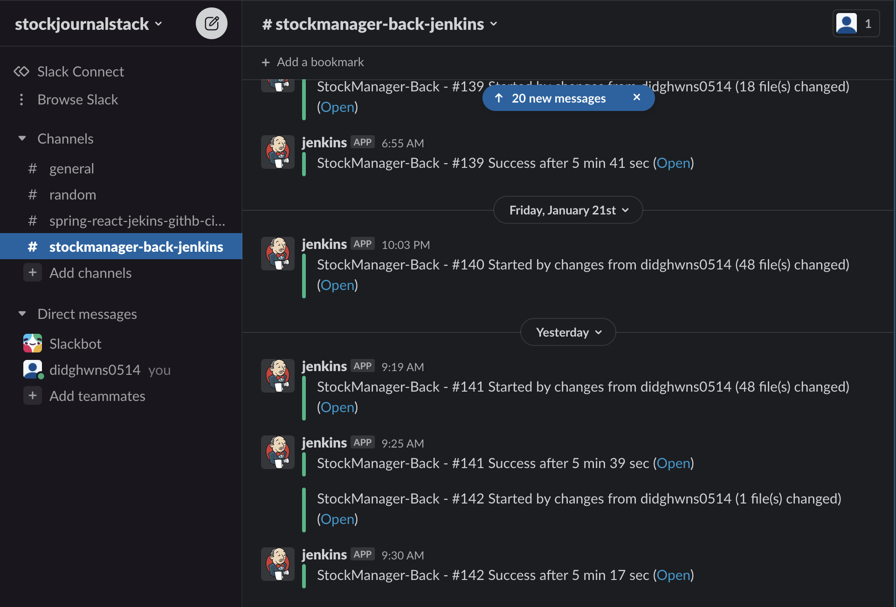
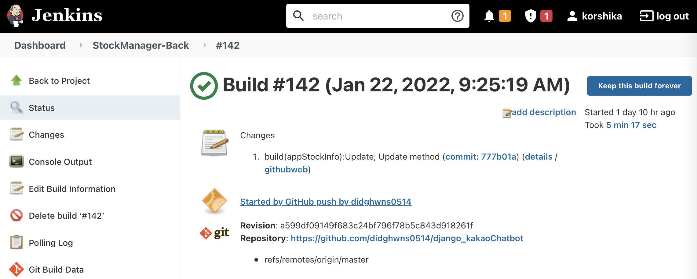
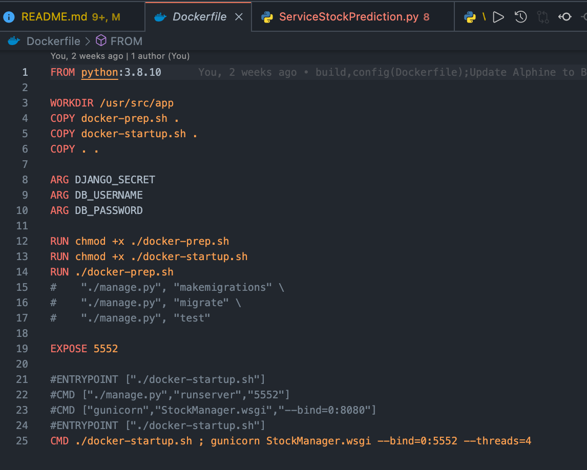
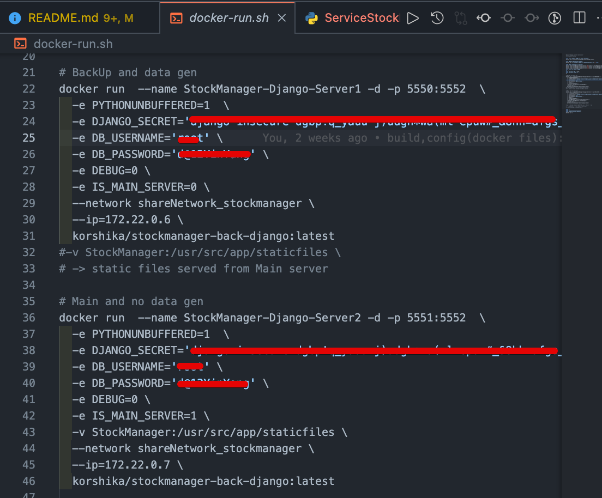
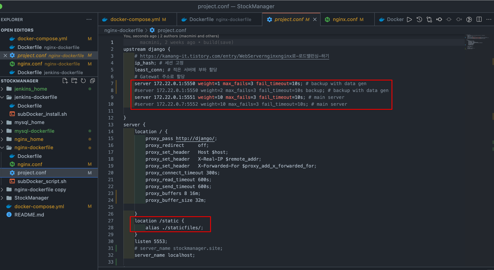
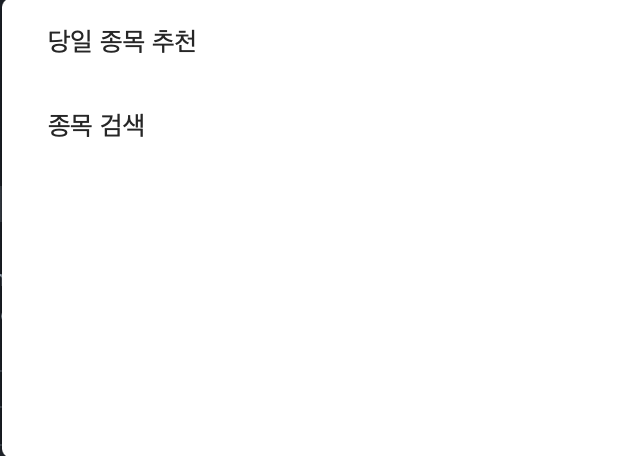
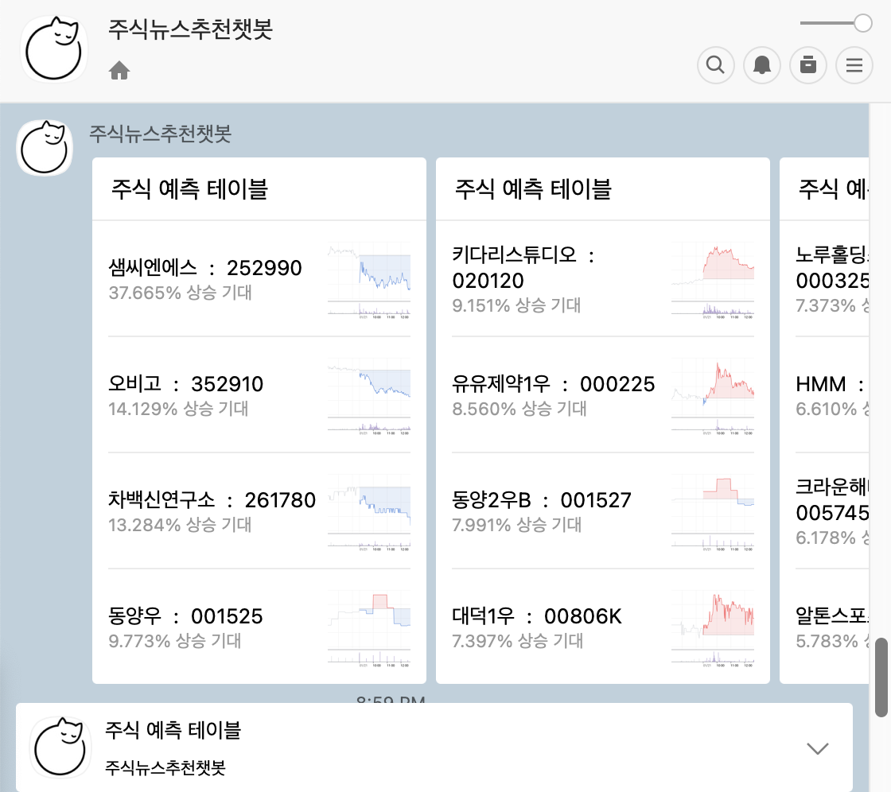
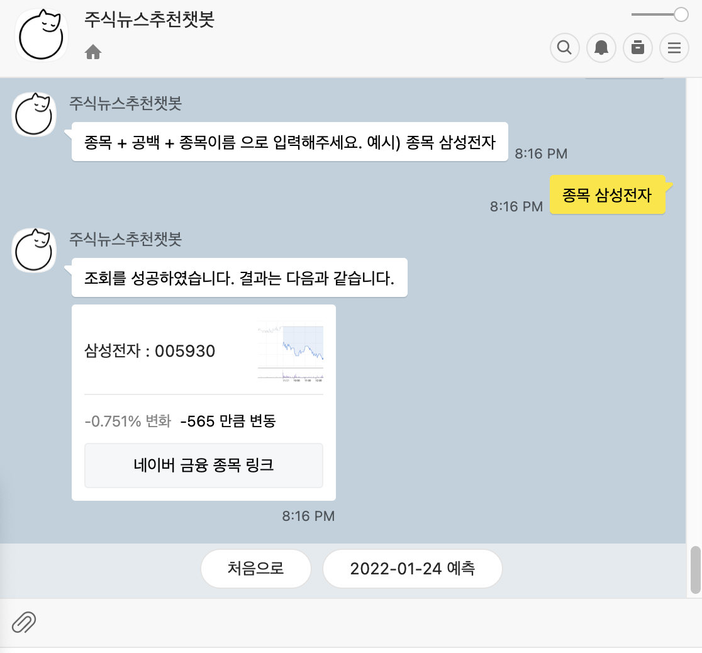

# - django_kakaoChatbot -

An django framework that communicates with Kakao API server using provided front-end url. <br/>
<br/>
Will provide you **`Daily Top Stocks`** at any time thorugh KakaoTalk as front.

> Is now served using DNS <a href=www.stockmanager.site>www.stockmanager.site</a>

<br/>

---

## Table of Contents

- Sections
  - [django_kakaoChatbot-What is used](https://github.com/didghwns0514/django_kakaoChatbot/blob/master/README.md#django_kakaoChatbot)
  - [Usage](https://github.com/didghwns0514/django_kakaoChatbot/blob/master/README.md#Usage)
  - [Maintainer](https://github.com/didghwns0514/django_kakaoChatbot/blob/master/README.md#Maintainer)

<br/>

## Sections

### django_kakaoChatbot

**Status :** _`Live on DNS`_

**Used :**

- Frontend

  - JSON response to communicate with kakao-chatbot API

- Backend
  - Business logic :
    - Periodic function to get Data and serve to frontend <br/>
    - XGBoost to predict stock trends on daily basis
  - Database : simple `mysql` and `bulk methods`

<br/>

---

### Specifics

#### **Framework & library used :**

- Django
- Frontend : Simple user page and dailty information served through with Kakao API-chatbot with JSON format
  > **Dealing with client request from kakao-chat application** <br/>
  >
  > 1. Client(kakao-chat application user) types formatted text that API-chatbot can understand <br/>
  > 2. API-chatbot transfroms the text in JSON and sends to url-end(OR port) where django is running <br/>
  > 3. Parse Body and get the JSON, handle the request using query and returns the response in JSON format

<br>

- CD & CI
  - Used Jenkins and github main branch for CD & CI
  - Used Docker-hub to maintain image for django  
    
  - Used Slack for build notification and progress notifictaion  
    
    <br>
    

<br>

- Server :

  - Service method:
    - **Gunicorn**
      - Dockerfile is used to start cmd execution of Gunicorn  
        
      - 2 Server is running concurrently envoked by shell script using docker; To ensure that running of data generating server and request handling server is well separated using Nginx  
        
    - **Nginx** as proxy server and static server infront of Gunicorn
      - Nginx as Load-balancer and proxy for 2 servers that are running
      - Also used for serving static files to ease the WAS load  
        

<br>

- Business logic:

  - XGBoost library to **`predict next 1 day stock forcast`** based on 7 ~ 8 days of stock history

    - Builder to build XGBoost Regression model

      ```python
      import xgboost
      import numpy as np
      import os
      from pathlib import Path

      from sklearn.metrics import (
          explained_variance_score,
          mean_squared_error,
          mean_absolute_error
      )

      import logging
      logger = logging.getLogger('appStockPrediction')

      class Builder:

          @classmethod
          def build(cls, model_type, X_train, y_train, X_test, y_test, PX):

              assert model_type in ["XGBoost", "LSTM", "Dense"]

              if model_type == "XGBoost":
                  return XGBoost.predict(X_train, y_train, X_test, y_test, PX)

              elif model_type == "LSTM":
                  pass

              elif model_type == "Dense":
                  pass

      ```

  - used apscheduler library to continuously crawl information on intervals using KRPYX
  - under scheduler, selenium based function is executed to parse stock information

    ```python
    from apscheduler.schedulers.background import BackgroundScheduler
    from appStockInfo.jobs import serviceKRStocks, serviceUSStocks
    import StockManager.subSettings as CONFI
    import os

    import logging
    logger = logging.getLogger('appStockInfo')

    def taskStockKR():

        if not CONFI.IS_MAIN_SERVER:
            if CONFI.DEBUG:
                hour = str(os.environ.get('HOUR'))
                min = str(os.environ.get('MIN'))
                logger.info("appStockInfo - taskStockKR; DEBUG true; not a main server/get data")
            else:
                hour = "3,19"
                min = "01"
                logger.info("appStockInfo - taskStockKR; DEBUG false; not a main server/get data")

            scheduler = BackgroundScheduler(timezone="Asia/Seoul")
            scheduler.add_job(serviceKRStocks, 'cron',
                              hour=hour, minute=min,
                              id="KRStocks" ) # 3,19, 01 : xx
            scheduler.start()

        else:
            logger.info("appStockInfo - taskStockKR; is a main server/dont get data")


    def taskStockUS():
        logger.info("appStockInfo - taskStockUS; not a main server/get data")
        if not CONFI.IS_MAIN_SERVER:
            scheduler = BackgroundScheduler(timezone="Asia/Seoul")
            scheduler.add_job(serviceUSStocks,'cron', hour="16", id="USStocks-1")
            scheduler.add_job(serviceUSStocks,'cron', hour="18", id="USStocks-2")

            scheduler.start()
        else:
            logger.info("appStockInfo - taskStockUS; is a main server/dont get data")


    ```

  - overriding the following method, the following logic will run periodically when app starts.
    
    

<br>

- mySQL

  - stores stock information parsed roughly every minute, stores it in the databse

  - Mainly used Q,F and query expressions

  - uses bulk-create and bulk-update + few column indexes when possible for faster performance <br/>

<br>

- Test
  - Every Model and service was test using **`django.unitest`** and python **`unittest`** library

<br>
<br>

---

## Reference

1. [참조1](https://www.dongyeon1201.kr/9026133b-31be-4b58-bcc7-49abbe893044#b530dc75-789d-4e2e-9993-edb2b328c89b)
2. [참조2](https://django-doc-test-kor.readthedocs.io/en/old_master/intro/tutorial01.html)
3. [참조3-장고 개발 기본](https://076923.github.io/posts/Python-Django-1/)
4. Test - 기본
   1. [장고 test 기본-1](https://velog.io/@hj8853/Django-Unit-Test)
   2. [장고 test 기본-2](https://ugaemi.com/tdd/Django-unit-test/)
   3. [장고 test 기본-3](https://velog.io/@maintain0404/Django에서-Test하기)
5. Test - model
   1. [장고 test Model-1](https://dev-yakuza.posstree.com/ko/django/test/models/)
6. User Model
   1. [장고 User Model-1](https://dev-yakuza.posstree.com/ko/django/custom-user-model/)
7. Logging in Django
   1. [장고 logging-1](https://hikoding.tistory.com/49)
8. ORM
   1. [장고 ORM-1](https://velog.io/@ikswary/Q-F-expression)
   2. [장고 ORM F expression-2](https://simpleisbetterthancomplex.com/tips/2016/08/23/django-tip-13-f-expressions.html)
   3. [장고 ORM 쿼리표현식](https://runebook.dev/ko/docs/django/ref/models/expressions)
9. TimeZone
   1. [TimeZone-1](https://devlog.jwgo.kr/2020/10/28/using-timezone-in-django/)
   2. [TimeZone-2](https://8percent.github.io/2017-05-31/django-timezone-problem/)
10. Admin lookup
11. [Search fields](https://medium.com/@bdv111/django-admin%EC%9D%98-%EA%B2%80%EC%83%89%EC%9D%84-%EC%9C%84%ED%95%9C-search-fields%EA%B0%80-db%EC%97%90-%EC%9D%BC%EC%9C%BC%ED%82%AC-%EC%88%98-%EC%9E%88%EB%8A%94-%EC%84%B1%EB%8A%A5-%EB%AC%B8%EC%A0%9C-3f816aff293e)
12. [Admin page 적용가능 방식-1](https://wayhome25.github.io/django/2017/03/22/django-ep8-django-admin/)
13. [Admin page 적용가능 방식-2](https://ssungkang.tistory.com/entry/Django-admin-%E1%84%91%E1%85%A6%E1%84%8B%E1%85%B5%E1%84%8C%E1%85%B5-%E1%84%92%E1%85%AD%E1%84%8B%E1%85%B2%E1%86%AF%E1%84%8C%E1%85%A5%E1%86%A8%E1%84%8B%E1%85%B3%E1%84%85%E1%85%A9-%E1%84%83%E1%85%A1%E1%84%85%E1%85%AE%E1%84%80%E1%85%B5)

## 중요 참조

1. [비슷한 django 예시](https://github.com/Ryu0n/stock_analyzer)

## 개발 참조

1. Apscheduler 정리
   1. [App Scheduler](https://ediblepotato.tistory.com/3)
   2. [Scheduler 사용 예시](https://medium.com/@kevin.michael.horan/scheduling-tasks-in-django-with-the-advanced-python-scheduler-663f17e868e6)
   3. [Cronjob 추가하기 1](https://hello-bryan.tistory.com/216)
   4. [Cronjob 추가하기 2](https://m.blog.naver.com/varkiry05/221257249284~~~~)
2. [CORS setting](https://hyeonyeee.tistory.com/65)
3. Static 관련 정리
   1. [Static 경로 설정 후, template 사용법](https://0ver-grow.tistory.com/912)
   2. [Static collect](https://nachwon.github.io/django-deploy-4-static/)
   3. [Static serving done by whitelabel](https://listed.to/@toolate/6967/heroku-x-django-static)
4. 주식 모듈 관련 정리
   1. Yahoo
      1. [yahoo finance 정리 1](https://scribblinganything.tistory.com/377)
   2. Finance Data Reader  
      2) [Finance Data Reader 정리 1](https://mokeya.tistory.com/72)

---

<br>

## Usage

### **Simple usage :**

- image

  1. Add the chatbot in your application <br/>
     

  2. Buttons will appear for your choice of methods <br/>
     
     <br/>
     

  3. Type in which stock catagory you are looking for <br/>
     **For looking up specific stock tick and it's prediction**
     

---

### Maintainer

**People**: Yang HoJun(양호준)(didghwns0514@gmail.com)

**More Info:**

- Github link : [Link](https://github.com/didghwns0514/django_kakaoChatbot)
- Personal Blog : [Link](https://korshika.tistory.com/)

**Suggestions:**

- Feel free to contact

---

## Definitions

_These definitions are provided to clarify any terms used above._

- **Documentation repositories**: Feel free to share. Thank you!
